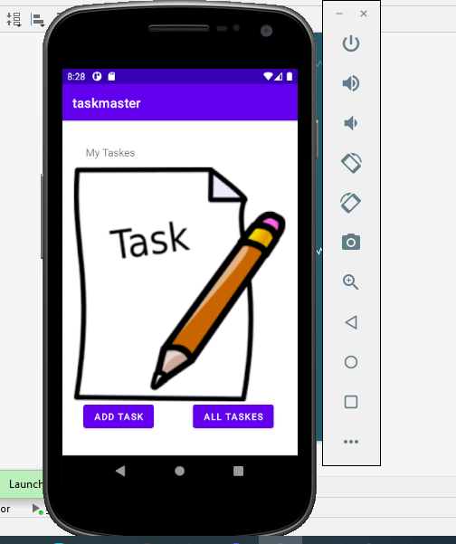
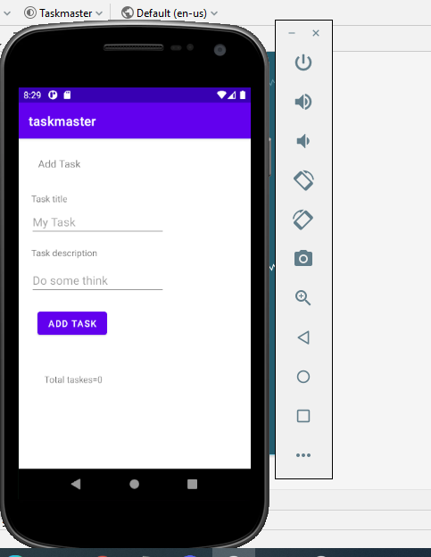
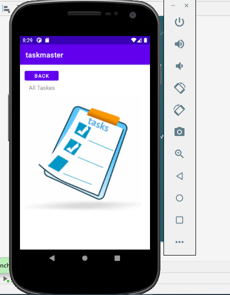
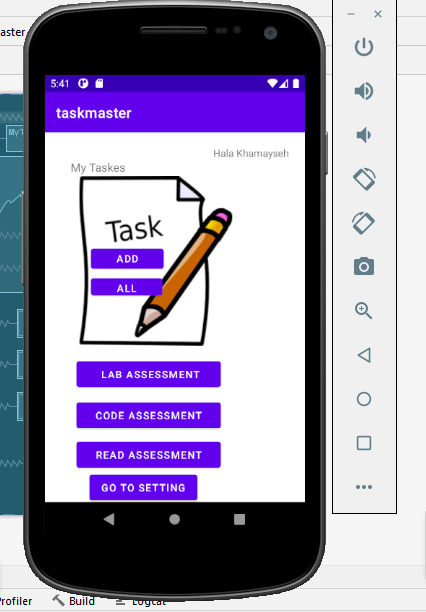
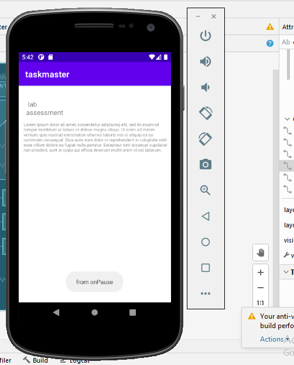
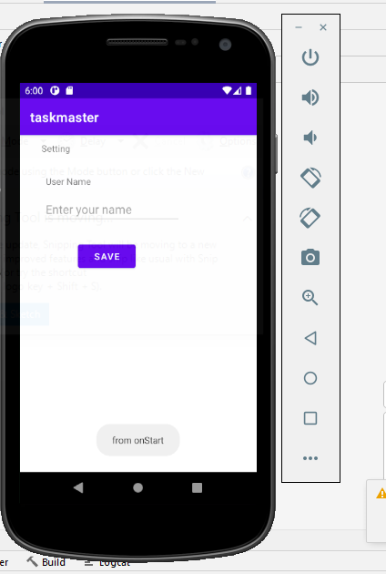

# taskmaster
### Lab: 26 - Beginning TaskMaster
####  building an Android app that contains:

1. Homepage
it should have a heading at the top of the page, an image to mock the “my tasks” view, and buttons at the bottom of the page to allow going to the “add tasks” and “all tasks” page.

2. Add a Task
allow users to type in details about a new task, specifically a title and a body. When users click the “submit” button, show a “submitted!” label on the page.

3. All Tasks
should just be an image with a back button; it needs no functionality.

### Lab: 27 - Data in TaskMaster
1. Homepage

The main page should be modified to contain three different buttons with hardcoded task titles. When a user taps one of the titles, it should go to the Task Detail page, and the title at the top of the page should match the task title that was tapped on the previous page.

The homepage should also contain a button to visit the Settings page, and once the user has entered their username, it should display “{username}’s tasks” above the three task buttons.

4. Detail page
Create a Task Detail page. It should have a title at the top of the page, and a Lorem Ipsum description.

5. Settings page
Create a Settings page. It should allow users to enter their username and hit save.
